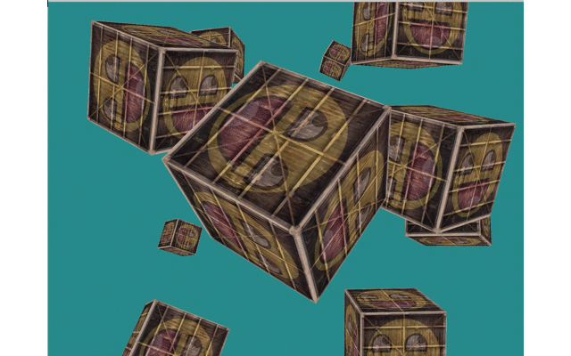

# Notes

## Coordinate systems

Local space - World space - View space - Clip space - Screen space 

### Projection matrix

```
glm::perspective(glm::radians(45.0f), (float)screenWidth / (float)screenHeight, 0.1f, 100.0f)
```

## Z-buffer

```
glEnable(GL_DEPTH_TEST);
[...]
while (...) {
    glClear(GL_COLOR_BUFFER_BIT | GL_DEPTH_BUFFER_BIT);
    DrawSomething; 
}
```

