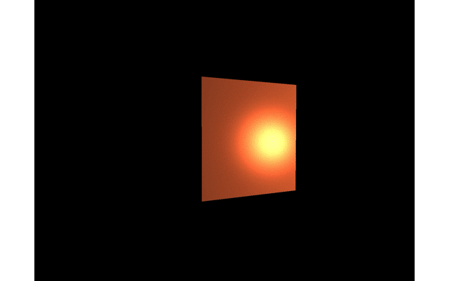
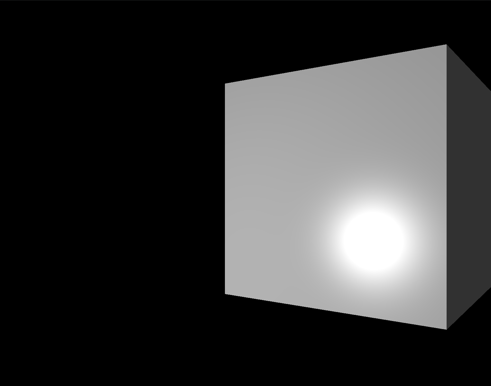
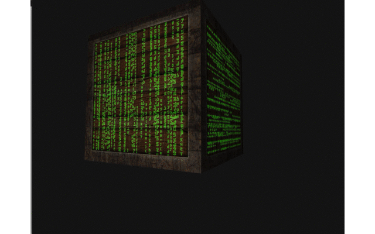
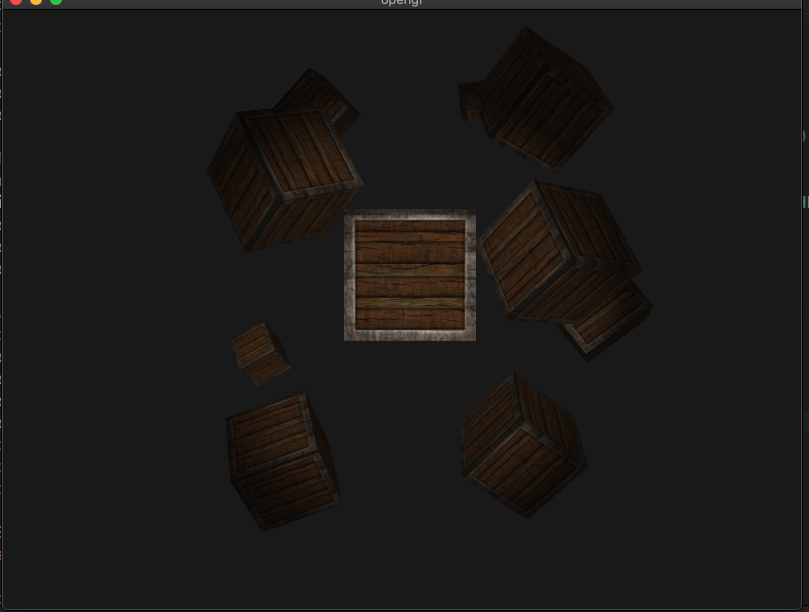
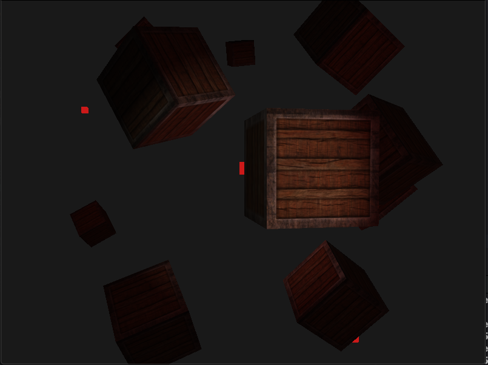

# Learning-OpenGL

## Part 1
### Hello Triangle

### Shader

### Texture

### Transformation

### Coordinate System

## Part 2 - Lighting

### Color

### Basic lighting

### Materials

### Lighting maps

### Light casters

### Multiple lights

